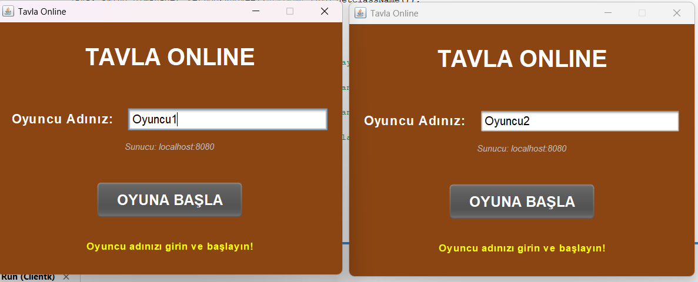
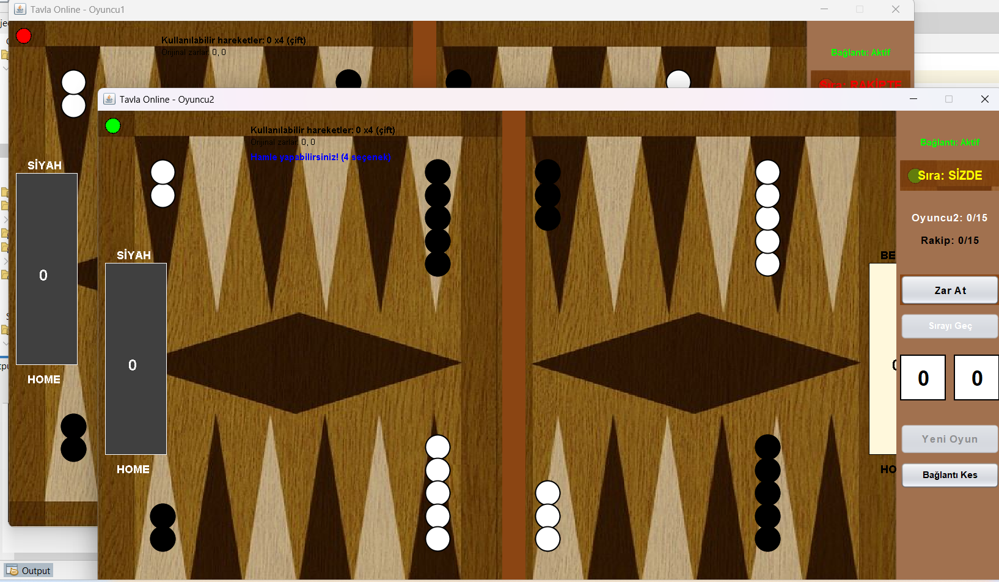

# 🎲 Tavla Online (Multiclient)

Bu proje Java Swing ve Socket programlama kullanılarak geliştirilmiş **online tavla oyunudur**.

## 🚀 Özellikler

- 🧑‍🤝‍🧑 Multi-client oyuncu sistemi
- 🔗 Server üzerinden oyuncu eşleştirme
- 🎮 Gerçek zamanlı oyun akışı
- 💬 Oyun içi mesajlaşma / event sistemi
- 🎲 Tavla oyun mekaniği

---

## 🖥️ Oyun Akışı

1. Oyuncular sunucuya bağlanır
2. Server oyuncuları eşleştirir
3. Oyun otomatik başlar
4. Taş hareketleri senkron çalışır

---

## 📸 Ekran Görüntüleri

### Ana Menü
 

### Oyun Ekranı
 

---

## 🛠️ Kullanılan Teknolojiler

- Java
- Swing (GUI)
- Socket Programming
- Multi-threading

---

## 📌 Not

Bu proje eğitim amaçlı geliştirilmiştir.
